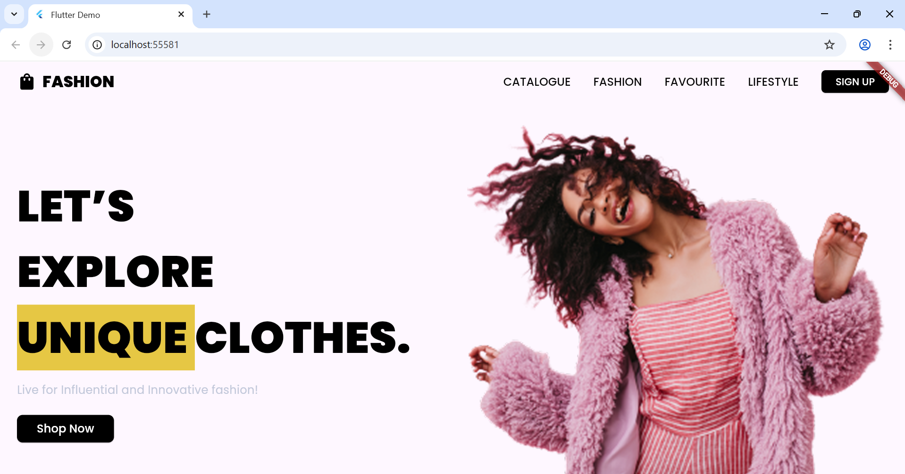
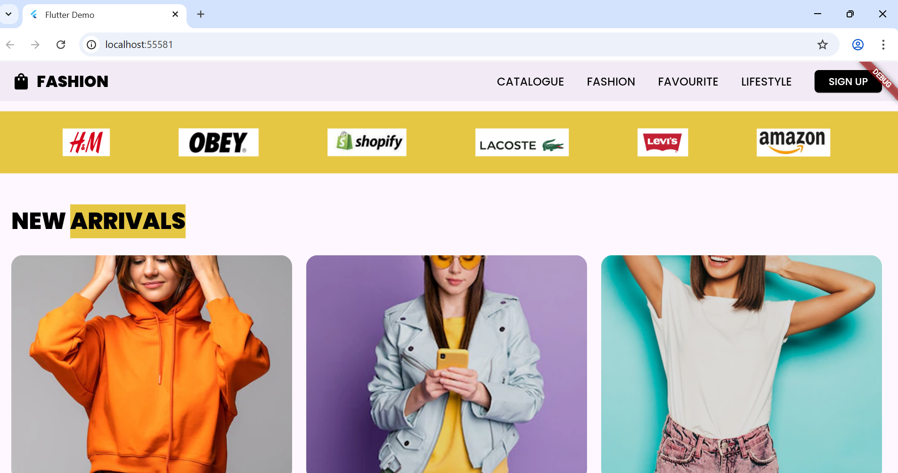
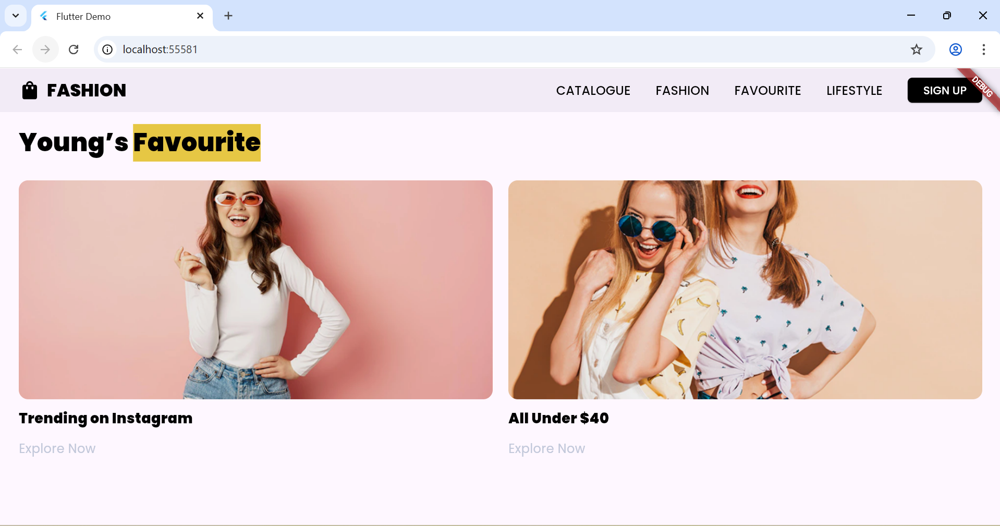
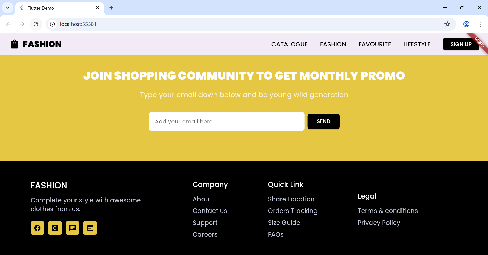

# fashionwebpageflutter
   A Responsive Fashion Web Landing Page built with Flutter.

## Overview
This project is a starting point for a Flutter web application. It showcases a responsive layout that adapts to different screen sizes, providing an optimal viewing experience on both desktop and mobile devices.

## Features
**Responsive Design**
   The app's layout dynamically adjusts for various screen sizes using Flutter's built-in responsive widgets.

**Brand Showcase**
   A section dedicated to displaying brand logos, which reflows gracefully on smaller screens using a Wrap widget instead of a Row to prevent icons from shrinking.

**Interactive Footer**
   A newsletter sign-up form is included, demonstrating form handling and layout responsiveness.

## 🧰 Tech Stack

This project is built using:

- **Flutter** – Cross-platform UI toolkit.

## See the UI in Action

Here's a glimpse of the Fashion Webpage Flutter in action:

